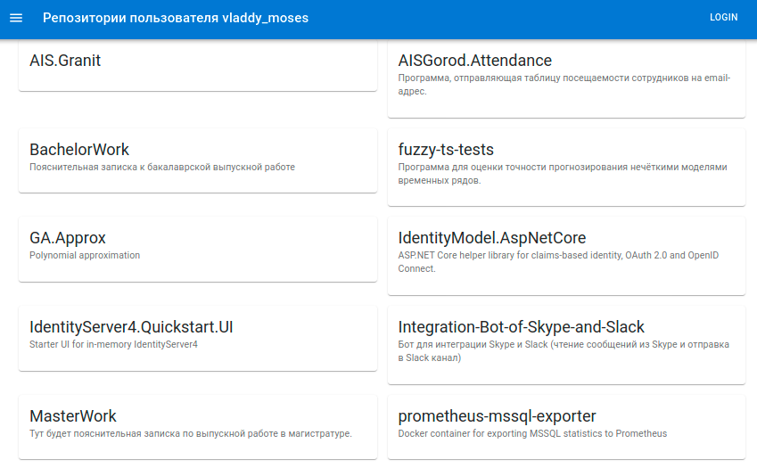

# Лабораторная работа №8 - Получение данных через API (Fetch)

## Цель работы

Освоить получение данных через fetch API и отображение данных на клиенте.

## Ход выполнения работы

1. Найти документацию по интеграции с API Github.
2. Реализация метода получения данных о репозиториях пользователя. Promise.
3. Хранение данных о репозиториях пользователя.
4. Отображение данных при помощи карточек.

## Документация API Github

Описание ресурсоа API Github можно найти здесь: <https://docs.github.com/en/rest>.

Пример данных со списком репозиториев пользователя _vladdy-moses_: <https://api.github.com/users/vladdy-moses/repos>.

## Метод получения данных

В качестве базы будет использоваться приложение из л/р № 7.

Пусть в `App.tsx` будут выводиться карточки со списком репозиториев.

Для того, чтобы это сделать, надо:

1. Объявить интерфейс с информацией о репозитории: названии, описании, ссылке на github.
2. Создать асинхронный метод по получению данных от API при помощи fetch API.
3. Добавить вывод от API в `console.log` и вызвать метод, чтобы убедиться, что он работает.

Получение данных надо реализовать при помощи Fetch API.
Информацию можно получить здесь: <https://developer.mozilla.org/ru/docs/Web/API/Fetch_API>.

Пример функции:

```tsx
let getData = () => {
    fetch(`https://api.github.com/users/vladdy-moses/repos`)
    .then(res => res.json())
    .then((res: GithubRepo[]) => {
        console.log(res);
    })
};
```

## Добавление состояния и вывод данных на экран

Проведите самостоятельно.

В качестве состояния можете использовать массив элементов с интерфейсом `GithubRepo`.

Должно получиться что-то наподобие этого:


