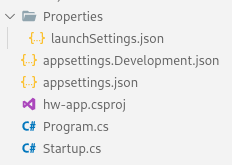
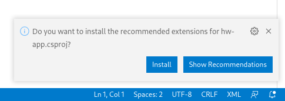
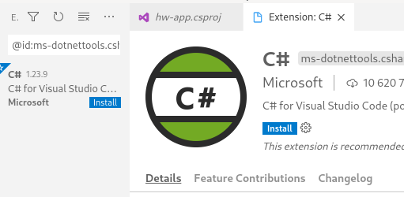
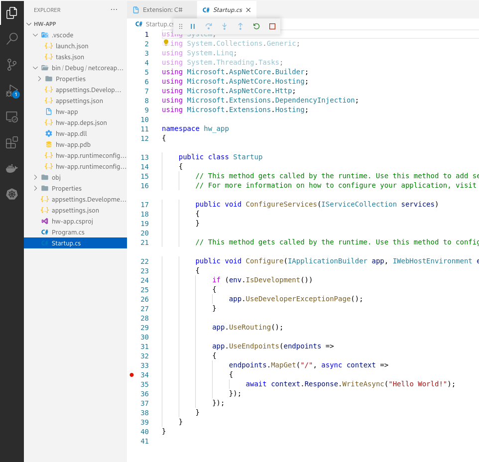
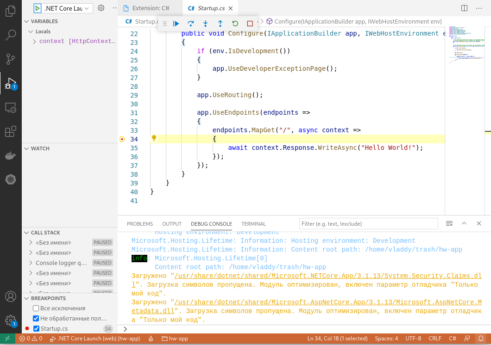

# Создание веб-приложения при помощи ASP.NET Core

## Цель работы

Получить навыки в создании кросс-платформенного веб-приложения в среде ASP.NET Core при помощи открытых кросс-платформенных инструментов.

## Ход работы

1. Установка Visual Studio Code.
2. Установка .NET (Core) SDK.
3. Создание простейшего веб-приложения.
4. Настройка Visual Studio Code для отладки приложения.
5. Изучение основных концепций ASP.NET Core.
6. Изменение pipeline.
7. Оформление кода и отчёта.

## Прочтите внимательно перед выполнением работы

Для сдачи лабораторной работы необходимо будет отправить на проверку как код, так и отчёт со скриншотами.
Так что сразу озаботьтесь их созданием.

Форма отчёта - свободная.
Главное, чтобы было понятно, что работу выполняли именно Вы.

## Установка Visual Studio Code

Visual Studio Code (VS Code) -- кросс-платформенный инструмент для разработки и не только.
Очень грубо, VS Code можно считать очень прокаченным блокнотом с кучей плагинов.
Плагины при этом могут быть различные: добавление иконок в дерево папок и файлов, добавление поддержки форматирования, отладки и запуска исходного кода, средства доступа к удалённым серверам, возможность работать с контейнерами и т.д.

Скачать и установить Visual Studio Code можно с официального сайта: <https://code.visualstudio.com/>.
При установке можете отказаться от добавления VS Code в контекстное меню и т.д.
Единственное, что можете оставить - это добавление в PATH, если это, конечно, будет спрашиваться при установке.
Почитать подробнее про PATH можно тут: <https://ru.wikipedia.org/wiki/PATH_(%D0%BF%D0%B5%D1%80%D0%B5%D0%BC%D0%B5%D0%BD%D0%BD%D0%B0%D1%8F)>.

## Установка .NET (Core) SDK

Перед выполнением этого шага необходимо убедиться: вдруг на Вашем ПК уже установлено необходимое программное обеспечение.

Для этого в консоли или командной строке (для Windows сейчас рекомендуется использовать PowerShell) следует набрать следующую команду:

```
dotnet --list-sdks
```

Если вывод будет содержать строку наподобие `3.1.407 [/usr/share/dotnet/sdk]` и номер версии будет из актуальных (на март 2021 это 3.1, 5.0), то всё хорошо.
В противном случае необходимо произвести установку.

Для этого необходимо установить .NET SDK (для версии 5.0) или .NET Core SDK (для версии 3.1) с официального сайта: <https://dotnet.microsoft.com/download>.

> Как можете видеть, из названия исчезает слово "Core".
> Это часть политики Microsoft по объединению своих продуктов, развивающихся параллельно: .NET Framework 4.8 и .NET Core 3.1 в общий продукт .NET 5.
> ASP.NET Core - это платформа для создания веб-приложений, использующих .NET.
> C# - язык программирования, позволяющий работать с .NET.

После установки SDK под свою систему и возможной перезагрузки компьютера выполните повторно команду из начала раздела.
Теперь она должна выводить данные корректно.

## Создание простейшего веб-приложения

Создавать простейшее веб-приложение на ASP.NET Core будем из консоли (командной строки).
Во-первых, это даёт вам возможность поработать с командной строкой.
Во-вторых, этот метод взаимодействия с утилитами / платформами / серверами является распространённым в профессиональной разработке и администрировании.
В-третьих, где ещё, если не в нашем курсе? :)

Создайте пустую папку где-нибудь на Вашем компьютере.
Постарайтесь не использовать в пути до этой папки пробелы и отличные от английских букв и цифр символы.

Перейдите в папку при помощи команды `cd`.
Например, `cd d:\labworks\ip`.
Иногда в windows требуется первой командой указать букву диска, например, `d:`, а потом уже делать _change directory (cd)_.

После этого введите следующую команду:

```
dotnet new web -n hw-app
```

Что здесь происходит:

* _dotnet_ - общая команда для работы с платформой .NET (dot - это "точка" по-английски);
* _new_ - команда по созданию чего-то нового;
* _web_ - шаблон для создания простейшего веб-приложения. Есть и другие шаблоны, их можете поискать самостоятельно или с помощью команды `dotnet new`;
* _-n_ - начало аргумента _name_, то есть задание имени будущего веб-приложения;
* _hw-app_ - название будущего приложения. Можете использовать своё название.

В результате выполненных шагов в вашей папке создастся ещё одна папка, в которой будет примерно следующий набор файлов:



Если у Вас также, то значит всё хорошо.

## Настройка Visual Studio Code для отладки приложения

Теперь пришло время соединить предыдущие пункты.

Для этого перейдите в консоли в папку с приложением.
В примере выше это будет _d:\labworks\ip\hw-app_.
После этого наберите команду `code .`.
Это должно запустить Visual Studio Code с открытой папкой с проектом, т.е. в дереве файлов должны быть те же файлы, что и на снимке экрана выше.
Если этого не произошло, Вы можете самостоятельно открыть папку через меню _File_ -> _Open Folder_.

Если Вы зайдёте в файл _.csproj_, VS Code снизу справа предложит установить необходимые расширения для работы с такими файлами.
Установите расширение _C#_.





Возможно придётся перезагрузить VS Code.

После этого возникнет подсказка о добавлении необходимых задач для найденного проекта на языке C#.
Можете смело их добавить.


В итоге должна создаться папка _.vscode_ с двумя файлами.

Теперь, пока не вдаваясь в подробности кучи сгенерированного кода, зайдите в _Startup.cs_ и поставьте точку останова после `endpoints.MapGet("/",...`.



При нажатии на F5 у Вас должен запуститься веб-сервер: в _Debug Console_ снизу будет выведено много информации.
Скорее всего у Вас одновременно с этим запустится веб-браузер с Вашим пока ещё пустым сайтом.
Если этого не произошло, можете поискать ссылку вида <http://localhost:5000> в выводе консоли отладки самостоятельно.

> _localhost_ - это домен локального ПК.
> Никто другой Ваш сайт по такому адресу не увидит.

Заметьте, что выполнение программы остановилось в точке останова:



Если у вас всё работает похожим образом, значит всё настроено правильно.

## Изучение основных концепций ASP.NET Core

Перед ознакомлением с основами ASP.NET Core, необходимо ознакомиться с основами построения веб-серверов.
Как минимум надо вспомнить или узнать, что такое: протокол HTTP, запрос, ответ, тип запроса (GET, POST, PUT, ...) код ответа (200 OK, 404 NOT FOUND, 500, ...), составные части URL (схема, домен, путь, query-string, hash).

После этого можно переходить к основам ASP.NET Core, которые хорошо изложены тут: <https://docs.microsoft.com/ru-ru/aspnet/core/introduction-to-aspnet-core?view=aspnetcore-5.0#recommended-learning-path>.

Однако основные вещи изложу здесь, чтобы не заставлять вас сейчас читать столь сложный для понимания текст.

ASP.NET Core, как и другие современные платформы для построения веб-приложений, использует принцип _pipeline_ - запрос от клиента (браузера) попадает в начало "конвейера", где затем каждый обработчик (практически любая функция на _C#_) может его или изменить, или пропустить без изменений, или остановить конвейер в зависимости от самого запроса.
После прохождения всех обработчиков формируется ответ, который и возвращается клиенту (браузеру).

Примеры обработчиков:

* проверка, что запрос клиентом составлен правильно;
* проверка доступа клиента к запрашиваемому ресурсу;
* если по пути из запроса найден файл на веб-сервере, то можно его вернуть;
* а если файл не найден, может какая-то подпрограмма может забрать обработку на себя?
* "Хмм, всё, что начинается с /api, отдавайте мне, остальное мне не надо";
* отрисовка красивых страниц об ошибках (например, 404, 403, 500 и т.д.), если прошлые обработчики сказали, что запрос был плохим;
* обработчик-которые складывает с специальный файл информацию о запросах (логгер или служба/подсистема логирования).

Как видите, обработчиков бывает много, но этот конвейер где-то надо настроить.
В ASP.NET Core для этого существует класс _Startup.cs_ и метод _Configure_.
Как раз в нём настраивается порядок следования обработчиков.

В простейшем приложении порядок обработчиков такой:

* если окружение, в котором запускается сайт, для разработки, то надо включить обработчик по отрисовке красивых страниц с подробностями ошибок;
* необходимо включить обработчик, который сможет следить за тем, какие конкретно ресурсы запрашиваются;
* включатся обработчик по сопоставлению путей из запросов другим обработчикам;
* добавляется обработчик для _GET_-запросов по пути _/_: в ответ клиенту всегда пишется строка _"Hello World!"_.

Можете самостоятельно поискать по коду, как описанные выше строки отображаются в исходный код на _C#_.

Как видите, пока ничего сложного.

Далее необходимо сопоставить наше веб-приложение (по сути это набор обработчиков запросов) с конкретным веб-сервером.
Например, тем самым, что запускает ваше веб-приложение по адресу <http://localhost:5000>.

Это делается в файле _Program.cs_ (знакомый файл?) в методе _Main_ (знакомый метод?).
Здесь у нас настраивается хост: то есть та часть приложения, которая может предоставить доступ к вашему веб-приложения из внешнего мира.
Другими словами, здесь и настраивается веб-сервер.
ASP.NET Core использует лёгкий веб-сервер _Kestrel_, о котором Вы даже можете не знать.
В этом, и в простоте настройки, и заключается его лёгкость.

Таким образом, мы выяснили, что наше приложение - это набор обработчиков.
Они настраиваются в _Startup.cs_ в специальном методе.
Веб-сервер для доступа к нашему веб-приложению настраивается в _Program.cs_.

Что находится в других файлах, можете изучить самостоятельно.
Дам только наводку, что launchSettings необходимы для запуска веб-сервера, а appsettings - для настройки веб-приложения.

## Изменение pipeline

После того, как вы научились запускать простейшее веб-приложение для отладки и изучили базовые понятия конвейерной обработки в ASP.NET Core, самое время этот конвейер немного поменять.

Перед вами есть пример обработчика для _GET_-запросов по пути _/_.

Предлагается сделать ещё как минимум несколько обработчиков для _GET_-запросов и проверить в браузере, как они будут работать.
Например:

* При запросе _/time_ (через браузер необходимо будет перейти по адресу <http://localhost:5000/time>) должно выводиться текущее время.
* При запросе _/whoami_ должна выводиться информация о текущем браузере.
* При запросе _/error_ должен возвращаться такой код статуса, который придёт в query-строке в параметре _status_. Если не придёт, то отдавать код статуса _200_. Тогда запрос в браузере будет выглядеть примерно как <http://localhost:5000/error?status=403> и в этом случае выводить якобы ошибку о том, что нет доступа к ресурсу.

Для работы с запросом пользователя для получения информации о браузере или параметрах этого запроса следует изучить использование переменной `context`, которая передаётся в обработчик.
Там есть свойство `.Request`, которое должно Вам помочь.

## Оформление кода и отчёта

Код можете запаковать в архив и разместить также в облаке.
Файл с отчётом можете положить в этот же архив.

У меня к вам тут единственная просьба - не запаковывайте архивы в _.rar_.
Используйте лучше _.zip_ :)

Ссылка на регистрацию работы: <https://forms.gle/GtRTeK4MKuwVYHgc6>.
